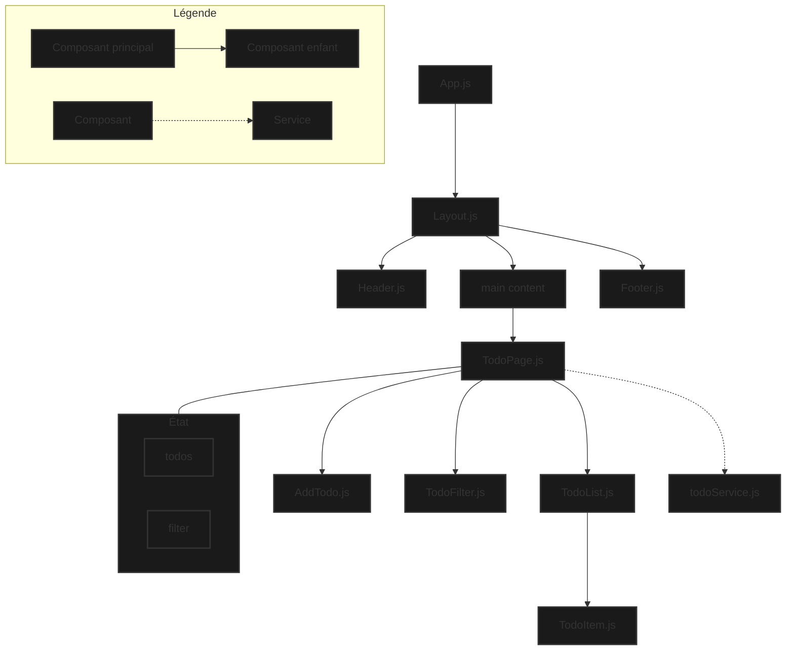

# Architecture de l'Application Todo List

## Structure des composants

```mermaid
flowchart TD
    %% Composants principaux
    App[App.js] --> Layout[Layout.js]
    Layout --> Header[Header.js]
    Layout --> Content[main content]
    Layout --> Footer[Footer.js]
    
    %% Page principale
    Content --> TodoPage[TodoPage.js]
    
    %% Composants de TodoPage
    TodoPage --> AddTodo[AddTodo.js]
    TodoPage --> TodoFilter[TodoFilter.js]
    TodoPage --> TodoList[TodoList.js]
    TodoList --> TodoItem[TodoItem.js]
    
    %% Services
    TodoPage -.-> TodoService[todoService.js]
    
    %% État et flux de données
    subgraph State[État]
        State1[todos]
        State2[filter]
    end
    
    TodoPage --- State
    
    %% Styles
    classDef default fill:#1a1a1a,stroke:#333,stroke-width:2px
    classDef layout fill:#1a1a1a,stroke:#333,stroke-width:2px
    classDef page fill:#1a1a1a,stroke:#333,stroke-width:2px
    classDef service fill:#1a1a1a,stroke:#333,stroke-width:2px

    classDef state fill:#1a1a1a,stroke:#333,stroke-width:2px
    
    class App default
    class Layout layout
    class TodoPage page
    class TodoService service
    class State state

    
    %% Légende
    subgraph Legend[Légende]
        L1[Composant principal] --> L2[Composant enfant]
        L3[Composant] -.-> L4[Service]
    end
```
